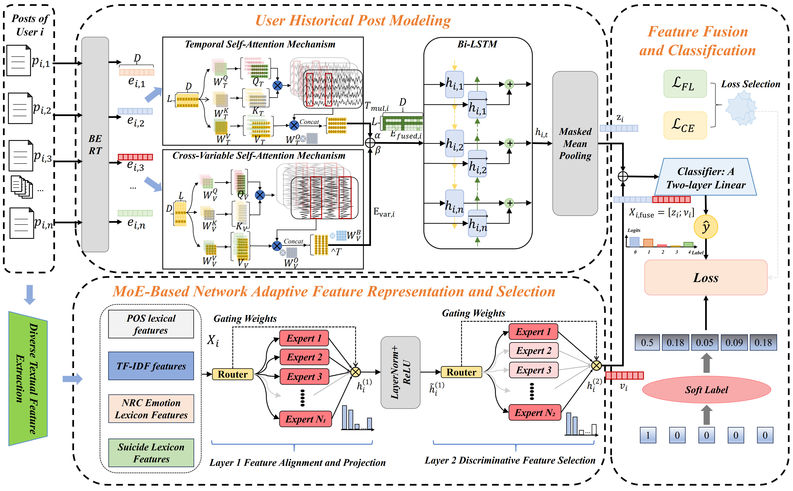

# FeaLearner 2.0

This repository implements FeaLearner 2.0 for suicide risk detection from user-level social media posts. The model uses two inputs:

- user post sequences represented by BERT embeddings;
- explicit textual features, including POS, TF-IDF, emotion lexicon, and suicide lexicon features.

The current reproduction code is organized as follows:

- `auto_select/reddit.py`: main training and reproduction script for Reddit, SIGIR, and BigData.
- `auto_select/weibo_train.py`: main training and reproduction script for Weibo.
- `auto_select/model/`: saved checkpoints for reproduction.
- `auto_select/reddit_ablation.py`: ablation study on Reddit.
- `auto_select/weibo_ablation.py`: ablation study on Weibo.

## Model Architecture

The overall architecture of FeaLearner 2.0 is shown in the model diagram below.


## Directory Structure

```text
.
+-- data/
|   +-- bert_embeddings.pkl                 # Reddit BERT embeddings
|   +-- sigir_bert_embeddings.pkl           # SIGIR BERT embeddings
|   +-- bigdata_bert_embeddings.pkl         # BigData BERT embeddings
|   +-- user_post_embeddings_bert_wwm.pkl   # Weibo BERT embeddings
+-- data_analy/
|   +-- extract_rbs_features.py             # Feature extraction for Reddit/SIGIR/BigData
|   +-- extract_weibo_features.py           # Feature extraction for Weibo
|   +-- feature_reddit_500.csv              # Reddit explicit features
|   +-- feature_sigir.csv                   # SIGIR explicit features
|   +-- feature_bigdata.csv                 # BigData explicit features
|   +-- feature_weibo.csv                   # Weibo explicit features
+-- auto_select/
|   +-- reddit.py                           # Main model for Reddit/SIGIR/BigData
|   +-- weibo_train.py                      # Main model for Weibo
|   +-- reddit_ablation.py                  # Reddit ablation study
|   +-- weibo_ablation.py                   # Weibo ablation study
|   +-- run_experiments.sh                  # Hyperparameter search for Reddit/SIGIR/BigData
|   +-- weibo_tune.sh                       # Hyperparameter search for Weibo
|   +-- twomoe.py                           # Two-layer MoE module
|   +-- tools/utils.py                      # Metrics and helper functions
|   +-- model/                              # Saved model checkpoints
|   +-- result/                             # Recorded search and reproduction results
```

## Reproduction Pipeline

Run the following commands from the project root unless otherwise specified.

### 1. Extract Explicit Textual Features

For Reddit, SIGIR, and BigData:

```bash
cd data_analy

# Reddit
python extract_rbs_features.py --dataset reddit

# SIGIR
python extract_rbs_features.py --dataset sigir

# BigData
python extract_rbs_features.py --dataset bigdata
```

For Weibo:

```bash
cd data_analy
python extract_weibo_features.py \
  --csv_path ../raw_data/weibo/weibo_data.csv \
  --output ../data_analy/feature_weibo.csv
```

The expected feature files are:

```text
data_analy/feature_reddit_500.csv
data_analy/feature_sigir.csv
data_analy/feature_bigdata.csv
data_analy/feature_weibo.csv
```

### 2. Generate BERT Embeddings

The training scripts require precomputed BERT embedding files in `.pkl` format. Each item should contain:

```python
{
    "label": label_id,
    "embeddings": post_embedding_sequence
}
```

The expected files are:

```text
data/bert_embeddings.pkl
data/sigir_bert_embeddings.pkl
data/bigdata_bert_embeddings.pkl
data/user_post_embeddings_bert_wwm.pkl
```

For Weibo, the embedding file is generated using a Chinese BERT/BERT-wwm encoder. For Reddit, SIGIR, and BigData, the corresponding BERT embedding files are used directly by `reddit.py`.

### 3. Train and Reproduce Main Results

Enter `auto_select/` before running the model scripts, because the saved checkpoints are written to `auto_select/model/`.

```bash
cd auto_select
```

#### Reddit

```bash
python reddit.py \
  --cv_heads 4 \
  --cv_d_model 128 \
  --lr 1e-4 \
  --batch_size 16 \
  --max_len 200 \
  --hidden_size 128 \
  --epochs 50 \
  --patience 10 \
  --classnum 5 \
  --data_embeddings ../data/bert_embeddings.pkl \
  --data_features ../data_analy/feature_reddit_500.csv \
  --save_path ./model/my_reddit_model.pth
```

#### SIGIR

```bash
python reddit.py \
  --cv_heads 8 \
  --cv_d_model 128 \
  --lr 1e-4 \
  --batch_size 16 \
  --max_len 300 \
  --hidden_size 128 \
  --epochs 50 \
  --patience 10 \
  --classnum 2 \
  --data_embeddings ../data/sigir_bert_embeddings.pkl \
  --data_features ../data_analy/feature_sigir.csv \
  --save_path ./model/my_sigir_model.pth
```

#### BigData

```bash
python reddit.py \
  --cv_heads 8 \
  --cv_d_model 256 \
  --lr 1e-4 \
  --batch_size 4 \
  --max_len 5 \
  --hidden_size 128 \
  --epochs 50 \
  --patience 10 \
  --classnum 4 \
  --data_embeddings ../data/bigdata_bert_embeddings.pkl \
  --data_features ../data_analy/feature_bigdata.csv \
  --save_path ./model/my_bigdata_model.pth
```

#### Weibo

```bash
python weibo_train.py
```

The saved checkpoints are:

```text
auto_select/model/my_reddit_model.pth
auto_select/model/my_sigir_model.pth
auto_select/model/my_bigdata_model.pth
auto_select/model/my_weibo_model.pth
```

## Loss Function Setting

All datasets use the same FeaLearner 2.0 architecture. Dataset-specific settings include the number of classes, feature dimensionality, sequence length, tuned hyperparameters, and loss function.

- Reddit, SIGIR, and BigData are trained by `reddit.py`.
- Weibo is trained by `weibo_train.py`.
- Weibo uses Cross-Entropy Loss.
- The other datasets use Focal Loss in the current reproduction code.

## Hyperparameter Search

For Reddit, SIGIR, and BigData:

```bash
cd auto_select
bash run_experiments.sh
```

For Weibo:

```bash
cd auto_select
bash weibo_tune.sh
```

Recorded search results are stored under:

```text
auto_select/result/reddit/
auto_select/result/sigir/
auto_select/result/bigdata/
auto_select/result/weibo/
```

## Ablation Studies

Only Reddit and Weibo ablation studies are included.

### Reddit Ablation

```bash
cd auto_select
python reddit_ablation.py
```

Output:

```text
auto_select/ablation_results.csv
auto_select/ablation/*.pth
```

### Weibo Ablation

```bash
cd auto_select
python weibo_ablation.py
```

Output:

```text
auto_select/weibo_ablation_results.csv
auto_select/ablation_weibo/*.pth
```

## Recorded Results

The main recorded results are located in:

```text
auto_select/result/reddit/reddit.csv
auto_select/result/sigir/results_stage1_structure.csv
auto_select/result/bigdata/bigdata.csv
auto_select/result/weibo/weibo.csv
```

The ablation result files are:

```text
auto_select/ablation_results.csv
auto_select/weibo_ablation_results.csv
```

These files should be used together with the saved checkpoints in `auto_select/model/` to reproduce the reported experiments.
